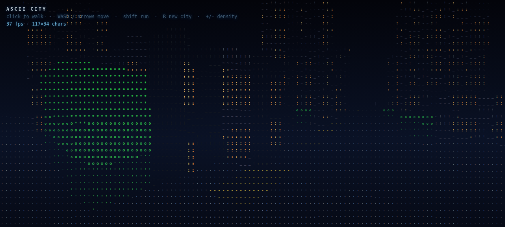

# ASCII CITY

A walkable 3D city rendered entirely with colored ASCII characters — no WebGL,
no game engines, no libraries. One HTML file, one `<canvas>`, one ray per
character cell.

**Live demo:** https://dkiiv.github.io/ascii-city/



## How it works

Each frame the renderer casts one ray per character cell of the viewport across
a grid-based heightfield world:

1. **World** — a 76×76 cell grid stores road / sidewalk / building / grass
   tiles, building heights, trees, and a baked streetlight glow map. A seeded
   generator lays out 2-cell-wide roads every 10 cells, drops random building
   footprints inside each block, and scatters trees and lamps.
2. **Ray cast** — a 2D DDA walk across the XZ grid solves the first hit per
   ray: building wall (entered below roof height), building roof (ray
   descending through the roof plane), tree blob, or the ground plane.
   Distance gives perspective, depth ordering, and fog.
3. **ASCII shading** — hits are converted to letters, digits and symbols from
   a density ramp. Nearby surfaces get larger, brighter clusters of characters;
   distant ones shrink and fade into the night fog. Building walls get a
   procedural window grid — lit panes glow warm, dark panes stay cold.
4. **Night palette** — a dim moon key light shades wall faces, streetlights
   bake a warm pool onto roads and sidewalks, and the sky carries twinkling
   stars and a moon.

## Controls

| Key | Action |
|---|---|
| Click | Capture mouse (look around) |
| W A S D / arrows | Walk |
| Shift | Run |
| R | Generate a new city |
| + / - | Character density up / down |
| Drag (touch) | Look around |

## Run it

Just open `index.html` in a browser, or:

```bash
python3 -m http.server 8080
```

## Tuning

All knobs live at the top of the script: `GW/GH` (city size), `CELL` (block
size), `MAXD` (view distance), `FOV`, fog color/density, and the `RAMP`
character density string.
